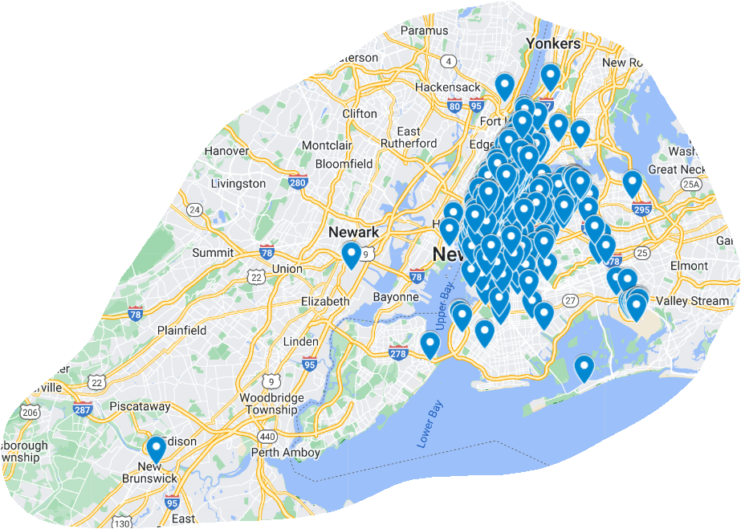
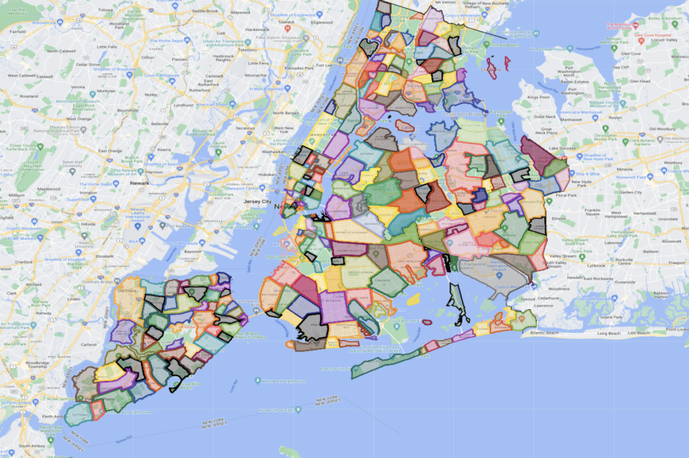
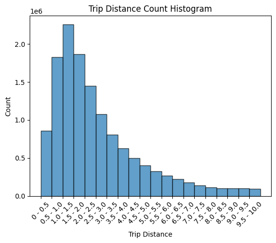

# INTRODUCTION:
The New York City Taxi Trip Data provides a comprehensive view into the bustling world of taxi transportation within the vibrant metropolis of New York City during the year 2013. With over 13 million rows of data, this dataset offers a rich resource for understanding the dynamics of taxi services, passenger behaviors, and urban mobility patterns.
Handling large datasets poses significant challenges, especially when conventional methods for data manipulation and analysis become impractical due to memory constraints. In such scenarios, adopting techniques tailored for big data becomes imperative to glean insights efficiently. In this code example, we'll demonstrate how to process and analyze large datasets using techniques suitable for big data, focusing on reading data line by line and employing memory-efficient methods for gaining insights.
# New York City Taxi Trip Data
This is a New york cty taxi data covering the year of 2013.

# 1. What datetime range does your data cover?  How many rows are there total?

There are total 13990177 rows.

<ins>**Pickup Datetime range:**<ins> 

Minimum Date: 2013-02-01 00:00:00

Maximum Date: 2013-02-28 23:59:59

<ins>**Dropoff Datetime Range-**<ins>

Minimum Date: 2013-02-01 00:00:55

Maximum Date: 2013-03-01 01:15:48

# 2.	What are the field names?  Give descriptions for each field.
As per the data provided, there are in total 14 attributes. The attributes are a combination of numerical and categorical variables. 

**The feild names are :** 'medallion', 'hack_license', 'vendor_id', 'rate_code', 'store_and_fwd_flag', 'pickup_datetime', 'dropoff_datetime', 'passenger_count', 'trip_time_in_secs', 'trip_distance', 'pickup_longitude', 'pickup_latitude', 'dropoff_longitude', 'dropoff_latitude'

Out of these all, medallion, hack_license, vendor_id, rate_code, store_and_fwd_flag are ID type variables i.e., varchar's  pickup_datetime, dropoff_datetime  are datetime objects, passenger_count, trip_time_in_secs, are integers, trip_distance is float and rest are latitudes and longitudes will be floats.

**Medallion-** It looks like a car ID for yellow taxi's in NYC.

**Hack_Licence-** It looks like a driver ID or driver Licence.

**Vendor_ID-** There are only two types of vendors CMT or VTS.

**Store and fwd flag-** It looks like a Yes, No or null values.

**rate code-** There are total 12 unique rate codes, it looks like taximeter rate.

**Pickup Datetime-** Pickup time.

**dropoff datetime-** drop off time.

**Passenger counts-** No. of passengers per each trip.

**Trip time in secs-** total time in seconds per trip.

**Pickup Latitude-** Pickup Latitude.

**Dropoff latitude-** dropoff latitude.

**Pickup Longitude-** Pickup Longitude.

**Dropoff Longitude-** Dropoff longitudde.

# 3.	Give some sample data for each field.

The first five rows of the Dataset:

-  **medallion:**	1B5C0970F2AE8CFFBA8AE4584BEAED29, 	B42249AE16E2B8E556F1CB1F940D6FB4, 	890699222C47C09FBC898758CEC69762, 	74B7D835C2CD98606D5256DA8A38E045, 	4003B8478418FEC5D761E2F37602769B, 

-   **hack_license:**	D961332334524990D1BBD462E2EFB8A4, 	D4BB308D1F3FCB3434D9DB282CDC93D7, 	6318C3AEC02248928C3345B5805EB905, 	D5E278C918256D1F97680A1F04D290E0, 	0B766F1054A5C16D86BC023858BD8143, 

-   **vendor_id:**	CMT 	CMT 	CMT 	 CMT 	CMT

-   **rate_code:** 1 	1	1	1	1

-  **store_and_fwd_flag:**	N	N	N	N	N

-   **pickup_datetime:**	2013-02-08 23:35:14, 	2013-02-07 12:20:16,	   2013-02-08 08:56:54 ,  	2013-02-08 09:37:02,	   2013-02-08 19:31:25

-   **dropoff_datetime:**	2013-02-08 23:42:58,	2013-02-07 12:50:27,	2013-02-08 08:59:43,	2013-02-08 09:50:50,	2013-02-08 19:46:23

-   **passenger_count:**	1	 4  	1   	1   	1

-   **trip_time_in_secs:**	463,	1810,	168,	828,	897

-   **trip_distance:**	0.8,	3.1,	1.0,	2.1,	3.3

-   **pickup_longitude:**	-73.992439	-73.989494	-73.963036	-73.987953	-73.987282

-   **pickup_latitude:**	40.724487	40.769588	40.799141	40.728764	40.743042

-   **dropoff_longitude:**	-73.984421	-73.990303	-73.972168	-74.007118	-74.010284

-    **dropoff_latitude:**	40.718903	40.737347	40.786446	

# 4.	What MySQL data types / len would you need to store each of the fields? a.	int(xx), varchar(xx),date,datetime,bool, decimal(m,d)
 -      medallion           Varchar(50) 
 -      hack_license        Varchar(50)
 -      vendor_id           Varchar(50) 
 -      rate_code           int64  
 -      store_and_fwd_flag  Booliean 
 -      pickup_datetime     datetime object 
 -      dropoff_datetime    datetime object
 -      passenger_count     int64  
 -      trip_time_in_secs   int64  
 -      trip_distance       Decimal(4,2)
 -      pickup_longitude    Decimal(8,6)
 -      pickup_latitude     Decimal(8,6)
 -      dropoff_longitude   Decimal(8,6)
 -      dropoff_latitude    Decimal(8,6)

# 5.	What is the geographic range of your data (min/max - X/Y)? a.	Plot this (approximately on a map)

given are the GPS coordinates at the start of the trip, end of the trip. as per the analysis there are some null values in the dropoff locations. 

Also given below are the minimum and maximum values for latitudes and longitudes at pickup and dropoff locations. It is observed from that the values are outliers at both ends:

| Min Pickup Latitude  | Max Pickup Latitude | Min Pickup longitude  | max pickup longitude | Min Drop-off Latitude  | Max Drop-off Latitude  |  Min Drop-off Longitude   |   Max Drop-off Longitude  |
| ------------- | ------------- |-----------| ------------- | ------------- |-----------| ------------- | ------------- |
| -3447.9175  | 3210.3582| -2120.0469  | 2228.7659 | -2491.2139  | 2228.7683 |  -3481.1277  |   3577.1321 |


Since these seemed like extreme values, the analysis is done for the 1%, 5%, 25%, 50%, 75% and 99% lat and longitude values to get the boundaries of the map. It is observed that some of the values are 0's but rest of the values seem like the lat and lon values of the New York city which seems accurate since the data is for the city of New York taxi trips, and given below are the values:

**Pickup Latitude Statistics:**

| count  | mean | std  | min | 25%   | 50%  |  75%   |   max  |
| ------------- | ------------- |-----------| ------------- | ------------- |-----------| ------------- | ------------- |
| 13990176  | -| -| -3447.9175  |  40.753048 | 40.75275 |  40.752468 |   3210.3582 |


**Pickup Latitude Percentiles:**

| 1%   | 5%  |  95%   |   99% |
| ------------- | ------------- |-----------| ------------- |
| 0.0  | 40.704433| 40.788303| 40.807045  |


**Pickup Longitude Percentiles:**

| 1%   | 5%  |  95%   |   99% |
| ------------- | ------------- |-----------| ------------- |
| -74.013885  | -74.006668| -73.874565| 0.0  |


**Drop-off Latitude Percentiles:**

| 1%   | 5%  |  95%   |   99% |
| ------------- | ------------- |-----------| ------------- |
| 0.0  |40.689533| 40.793579|40.827335|


**Drop-off Latitude Percentiles:**

| 1%   | 5%  |  95%   |   99% |
| ------------- | ------------- |-----------| ------------- |
| -74.014633 |-74.007057| -73.902199 |0.0  |


As per the above values, GPS locations are  marked in the google map's and presented below.




ACTUAL NY NEIGHBOURHOOD MAP for comparision




# 6.	What is the average computed trip distance? (You should use Haversine Distance) a.	Draw a histogram of the trip distances binned any way you see fit.

a = sin²(Δφ/2) + cos φ1 ⋅ cos φ2 ⋅ sin²(Δλ/2)

c = 2 ⋅ atan2( √a, √(1−a) )

d = R ⋅ c

where	φ =  latitude, λ = longitude, R = earth’s radius (mean radius = 6,371km);

Using the above formula All trip distances are converted to the haversine distance and average obtained is : 19.47755414250351

**Given below are the statistics:**

It is observed that maximum value is 19754, which seemed like an outlier, hence the mean value obtained above will be a bit inaccurate and if outliers are treated using either mean or median inputation then the average mean will be correct.

| count  | mean | std  | min | 25%   | 50%  |  75%   |   max  |
| ------------- | ------------- |-----------| ------------- | ------------- |-----------| ------------- | ------------- |
| 13990176  | 19.477| 368.027| 0.0  |  2.044 | 2.056 |  2.067 |   19754.06 |


**Avg. Trip Distance : 19.47755414250351 km**

Based on the trip distances binned in the ranges below is the histogram.




# 7.	What are the distinct values for each field? (If applicable)

**Number of unique medallion values: 13416**


C7BF056F5E2EF6D4CCF68EA4A23502A7: 1836

BC9EE7F807E71ACA2AEA11CAB51604F8: 1803

C7C7A02A43EF93C55735C621C166327D: 1779
...
3328BDF9A4B9504B9398284244FE97C2: 1


**Number of unique hack values: 32063**

3F4E3506DB8F6F9DD0A78DBDB1C57B10: 1206

22CA618759C716436EA3257480199A32: 1204
66AC66EC81245F6D4AE9D2820D49212D:  1204

AB6F028ECDB62E44BE3ACEDE4E935ED6: 1202

C9674190984BA193FFD8DDCC019804CF: 1193

...
F2A5FBBE089CCD3004F8D43ACB4F123D:  1


**Number of unique Vendor IDs: 2**

**Vendor ID counts:**

CMT - 7038990

VTS - 6951186

**Number of unique Rate Codes: 12**

**Rate Code counts:**
1 - 13707439

2 - 209346

5 - 35928

4  - 19117

3 - 16617

0 - 1514

6 - 192

210 - 12

7 - 6

28 - 2

79 - 2

221 - 1


**Number of unique Store and Forward Flags: 3**

**Store and Forward Flag counts:**

Null - 6952551

N   -  6917268

Y   -  120357

**Null value count of the data**

Null values for only below attributes, no null values for rest of the attributes.

store_and_fwd_flag: 6952551 null values

dropoff_longitude: 113 null values

dropoff_latitude: 113 null values


# 8.	For other numeric types besides lat and lon, what are the min and max values?

<ins>**For other numerric Types:**<ins>

**Passenger Count Statistics:**

- min: 0
- max: 208

**Trip Time in Seconds Statistics:**

- min: 0
- max: 10800

**Trip Distance Statistics:**

- min: 0.0
- max: 100.0

**Description of numerical variables like passenger count, trip time and trip distance statistics.**

**Passenger Count Statistics:**


| count  | mean | std  | min | 25%   | 50%  |  75%   |   max  |
| ------------- | ------------- |-----------| ------------- | ------------- |-----------| ------------- | ------------- |
| 13990176  | 1.69| 1.37  | 0 | 1.0   | 1.0 |  2.0  |   208 |


**Trip Time in Seconds Statistics:**

| count  | mean | std  | min | 25%   | 50%  |  75%   |   max  |
| ------------- | ------------- |-----------| ------------- | ------------- |-----------| ------------- | ------------- |
| 13990176  | 701.856| 501.636  | 0 | 600   | 589 |  900  |   10800 |


**Trip Distance Statistics:**

| count  | mean | std  | min | 25%   | 50%  |  75%   |   max  |
| ------------- | ------------- |-----------| ------------- | ------------- |-----------| ------------- | ------------- |
| 13990176  | 2.741| 3.19  | 0.0 | 1.72   | 1.7 |  3.07   |   100.0 |


In passenger counts the maximum values obtaine as 208 is an outlier and further imputation needs to be done to do the analysis.

# 9.	Create a chart that shows the average number of passengers each hour of the day. (X axis should have 24 hours)

Given below is the avg passenger count per each hour:


Hour: 22, Average Passengers: 1.75
Hour: 21, Average Passengers: 1.73
Hour: 20, Average Passengers: 1.71
Hour: 19, Average Passengers: 1.71
Hour: 18, Average Passengers: 1.71
Hour: 17, Average Passengers: 1.70
Hour: 16, Average Passengers: 1.72
Hour: 15, Average Passengers: 1.72
Hour: 14, Average Passengers: 1.69
Hour: 13, Average Passengers: 1.68
Hour: 12, Average Passengers: 1.67
Hour: 11, Average Passengers: 1.67
Hour: 10, Average Passengers: 1.65
Hour: 09, Average Passengers: 1.63
Hour: 08, Average Passengers: 1.62
Hour: 07, Average Passengers: 1.59
Hour: 06, Average Passengers: 1.55
Hour: 05, Average Passengers: 1.60
Hour: 04, Average Passengers: 1.72
Hour: 03, Average Passengers: 1.76
Hour: 02, Average Passengers: 1.76
Hour: 01, Average Passengers: 1.76
Hour: 00, Average Passengers: 1.76


# 10.	Create a new CSV file which has only one out of every thousand rows.

```python
import csv
f=open('trip_data_2.csv','r')
r=csv.reader(f)


f2=open("NYC_Taxi_Subset.csv",'w')
f2.write('')
f2.close()
f2=open('NYC_Taxi_Subset.csv','a')
w=csv.writer(f2,delimiter=',',lineterminator='\n')
n=0
for row in r:
    if n%1000==0:
        w.writerow(row)
        print(n)   
    n+=1


f.close()
f2.close()
```
**Number of rows in the subset: 13991**

# 11.	Repeat step 9 with the reduced dataset and compare the two charts.


When two charts of average passengers are compared i.e., for the total data and for the subset data it can be observed that both look similar, and also it seeems like the taxi's are busy at all times of the day only slightly busy around morning 4 to 5 am and most busy aroud midnight.

# Conclusion

From the above analysis it can be observed that this is a raw data and there are a lot of errors in data, like some null values and 0's in latitudes and longitudes and Trip distance has a high maximum value which further needs to be looked into, since all the data is for NYC. Also the trip time max value is very high compared to other values. Before doing any predictive analysis on the data, data cleaning needs to be done.


 
